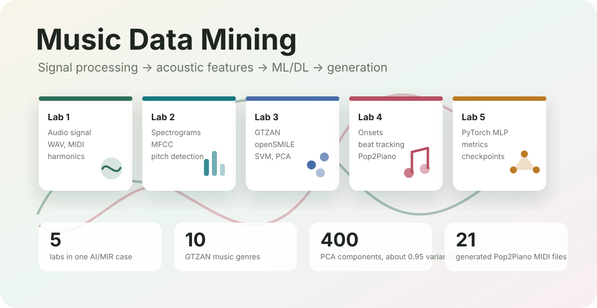

# Music Data Mining Portfolio



Портфолио-проект по факультативу **"Вычислительное музыковедение: модели и методы Music Data Mining"**.

Репозиторий собирает пять лабораторных работ в один законченный AI/MIR-кейс: от озвучки нот и базовой обработки аудиосигнала до классификации жанров, нейросетевых экспериментов и генерации музыки.

**Live dashboard:** [ilyadenisov88.github.io/MIR_music_data_mining](https://ilyadenisov88.github.io/MIR_music_data_mining/)  
Если страница еще не открывается, нужно включить GitHub Pages: `Settings -> Pages -> Deploy from a branch -> main / docs`.

## Showcase

Витрина проекта устроена как медиагалерея по лабораторным:

- **ЛР1:** мини-синтезатор нот, графики сигналов и сгенерированный piano audio.
- **ЛР2:** графики spectrum/MFCC/pitch detection и аудиофрагменты flute/violin.
- **ЛР3:** confusion matrix и визуальные результаты классификации жанров.
- **ЛР4:** onset/tempo/beat tracking, score generation и vocal/easy piano audio.
- **ЛР5:** графики обучения, validation metrics, confusion matrix и схемы экспериментов.

## Project Story

Цель проекта - показать, что я умею работать с музыкальными данными как с полноценным AI-доменом:

1. Анализировать аудиосигналы и MIDI.
2. Извлекать спектральные, мел-спектральные, MFCC и openSMILE-признаки.
3. Реализовывать классические MIR-алгоритмы: pitch detection, onset detection, beat tracking.
4. Обучать модели классификации музыкальных жанров на GTZAN.
5. Проводить нейросетевые эксперименты в PyTorch и сохранять чекпоинты.
6. Исследовать генеративные модели: Pop2Piano, MusicGen, c-RNN-GAN.

## Labs

| Lab | Topic | Main Result |
| --- | --- | --- |
| ЛР1 | Работа со звуковыми сигналами | Синтез звука, гармоники, чтение MIDI, генерация простой мелодии |
| ЛР2 | Акустические признаки и pitch detection | Спектрограммы, mel-spectrogram, MFCC, ZCR/FFT/autocorrelation/AMDF |
| ЛР3 | Классическое ML для жанров | GTZAN, openSMILE, PCA, k-NN, Logistic Regression, SVM, Decision Tree |
| ЛР4 | MIR-системы | Onset detection, tempo estimation, beat tracking, Pop2Piano, MusicGen |
| ЛР5 | Нейросети для музыкальных данных | PyTorch MLP, разные конфигурации сети, логирование, checkpoint-и |

## Highlights

- **Full AI pipeline:** signal processing, acoustic descriptors, feature engineering, supervised learning, neural networks and generation.
- **Interactive media showcase:** note synthesis, notebook plots, audio artifacts and generated-music examples.
- **Dataset:** GTZAN, 1000 tracks, 10 genres, 30 seconds per track, 22050 Hz mono audio.
- **Feature extraction:** spectrograms, mel-spectrograms, MFCC and openSMILE descriptors.
- **Classical ML:** k-NN, Logistic Regression, SVM, Decision Tree, PCA experiments.
- **Deep Learning:** PyTorch MLP models, metrics, confusion matrices and saved checkpoints.
- **Generative AI:** Pop2Piano, MusicGen and c-RNN-GAN artifacts.

## Repository Structure

```text
.
├── docs/
│   ├── assets/
│   │   ├── audio/
│   │   ├── images/
│   │   └── portfolio-overview.svg
│   └── index.html
├── ВычМуз/
│   ├── ЛР1/
│   ├── ЛР2/
│   ├── ЛР3/
│   ├── ЛР4/
│   ├── ЛР5/
│   ├── GAN.pptx
│   ├── GAN 2.0 Денисов Илья.pptx
│   ├── GAN текст.docx
│   └── c-rnn-gan-sample11.mp3
├── requirements.txt
└── README.md
```

## Data And Artifacts

- **GTZAN**: 1000 audio tracks, 10 genres, 30 seconds per track, 22050 Hz mono audio.
- **Feature cache**: `ВычМуз/ЛР3/smile_features.npy`.
- **Neural checkpoints**: `ВычМуз/ЛР5/models/basic.pth`, `ВычМуз/ЛР5/models/batch_size8.pth`.
- **Generated MIDI**: `ВычМуз/ЛР4/composers/midi_result1.mid` ... `midi_result21.mid`.
- **Audio examples**: piano, violin, flute, vocal and generated c-RNN-GAN sample.

## Tech Stack

Python, NumPy, pandas, matplotlib, librosa, openSMILE, scikit-learn, PyTorch, torchmetrics, Hugging Face `datasets`, transformers, Comet ML.

## How To View

The repository is useful in two modes:

1. **GitHub Pages dashboard** - the main reviewer-facing showcase with audio, plots and lab highlights.
2. **GitHub README** - quick portfolio overview and project context.

The original notebooks are kept in `ВычМуз/` as source materials, but the intended way to review the project is the live dashboard.

To enable the dashboard on GitHub:

1. Open repository settings.
2. Go to `Pages`.
3. Select `Deploy from a branch`.
4. Choose branch `main` and folder `/docs`.
5. Open `https://ilyadenisov88.github.io/MIR_music_data_mining/`.

## Why This Fits An AI Portfolio

Проект показывает полный цикл работы с неструктурированными данными:

- обработка временных рядов и аудио;
- feature engineering;
- supervised learning;
- dimensionality reduction;
- метрики качества и confusion matrix;
- deep learning experiments;
- генеративные модели для музыки.
