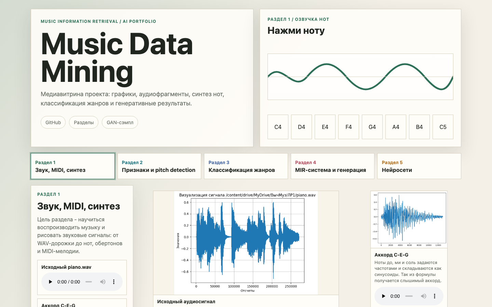

# Music Data Mining Portfolio

**Витрина проекта:** [ilyadenisov88.github.io/MIR_music_data_mining/docs/](https://ilyadenisov88.github.io/MIR_music_data_mining/docs/)

## Разделы

| Раздел | Тема | Что показано |
| --- | --- | --- |
| Раздел 1 | Звук, MIDI, синтез | Воспроизведение WAV, синтез C-E-G, обертоны, MIDI-мелодия |
| Раздел 2 | Признаки и pitch detection | Флейта, спектральные признаки, ZCR, FFT, autocorrelation, AMDF и озвучка pitch каждого метода |
| Раздел 3 | Классификация жанров | GTZAN, openSMILE, PCA, SVM, Logistic Regression, Decision Tree и матрицы ошибок |
| Раздел 4 | MIR-система и генерация | easy_piano.wav, energy peaks, onset detection, tempo estimation, нотная запись и MusicGen |
| Раздел 5 | Нейросети | PyTorch, loss/accuracy, Comet ML, confusion matrix, checkpoint-и и генеративные эксперименты |
